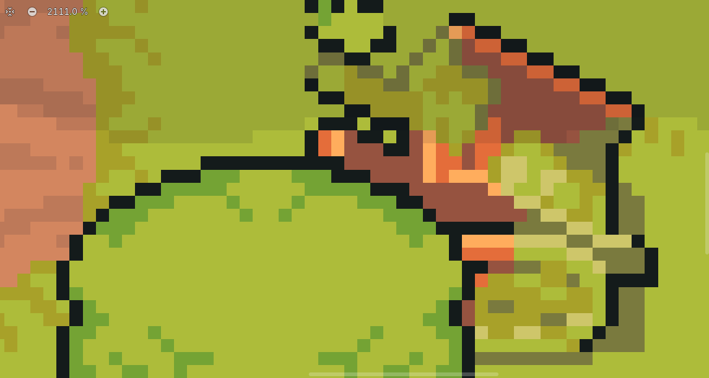
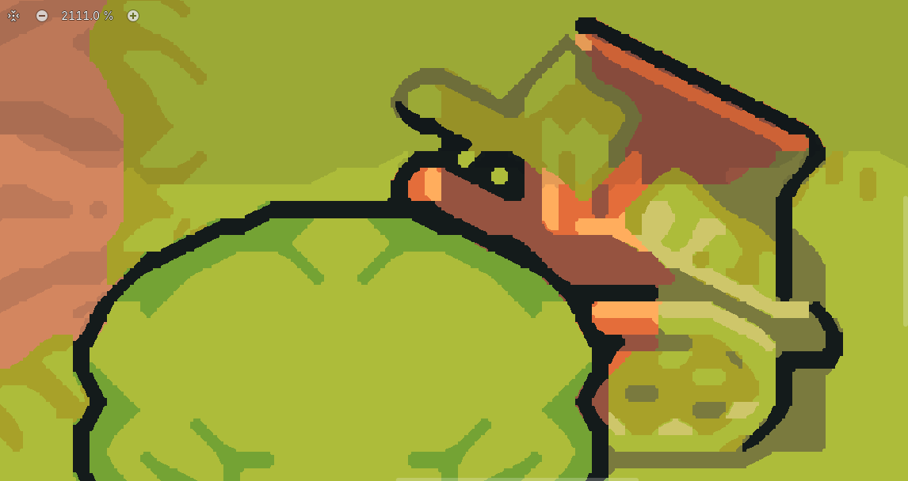

# xBRZ Sharp HD — Pixel-Art Upscaler for Godot 4

A `canvas_item` shader that upscales 2D pixel art into a crisp, "almost-HD" look
in the style of [Sokpop](https://sokpop.itch.io/) games — it reshapes the jagged
diagonals and curves of pixel art into clean lines **while keeping hard, solid
pixels with no anti-aliased fuzz between them**.

Built on the **xBRZ** algorithm, with a few modifications (see
[What's different](#whats-different)) to keep the result sharp instead of soft.

> Tested on Godot **4.7**. Works on any Godot 4.x.

---

## Preview

| Without shader (raw pixels) | With shader (`no_blend = true`) |
| --------------------------- | ------------------------------- |
|  |  |

---

## What's different

Plain xBRZ is an *anti-aliasing* scaler — it softens edges with blended in-between
colors. This build keeps the smart edge reshaping but changes the output to stay
sharp:

- **`no_blend` snap** — every output pixel is snapped to a real source color, so
  you get reshaped diagonals/curves but **no blended pixels** (crisp borders, you
  still "see the pixels").
- **Bilinear grid reconstruction** — the hard edge follows a smooth boundary at
  *output* resolution instead of xBRZ's coarse internal 4× grid, so diagonals
  don't read as "waves."
- **Cheaper** — `sqrt`-free equality tests and the source-size math moved to the
  vertex stage.

---

## Installation

1. Copy `xbrz.gdshader` into your project (e.g. `res://assets/shaders/`).
2. Set up the SubViewport pipeline below.

### Scene setup

The shader reads its input from the built-in `TEXTURE`, so it must live on a node
that actually *has* the viewport as its texture:

```
Main
├── SubViewport                 # your game renders in here
│   └── (your game world)
└── TextureRect                 # this is what's shown on screen
        material = ShaderMaterial(xbrz.gdshader)
        texture  = ViewportTexture -> SubViewport
```

**Critical settings for a sharp result:**

| Node          | Setting                | Value                              |
| ------------- | ---------------------- | ---------------------------------- |
| `SubViewport` | Size                   | your **native** res (e.g. 320×180) |
| `SubViewport` | Update Mode            | `Always`                           |
| `TextureRect` | Texture → Filter       | **Nearest**                        |
| `TextureRect` | Layout                 | Full Rect                          |
| `TextureRect` | Expand Mode            | `Ignore Size`                      |
| `TextureRect` | Stretch Mode           | `Scale`                            |

- Render the SubViewport at **native** resolution — xBRZ does its own 4× upscale.
- Prefer an **integer** final scale (320×180 → 1280×720 = 4×; → 1920×1080 = 6×).
  Non-integer scaling makes pixel sizes uneven.
- `Filter = Linear` anywhere will pre-blur the input and soften everything.

> You can also put the material directly on a `SubViewportContainer` (with the
> `SubViewport` as its child) instead of a separate `TextureRect` — both work.

---

## Parameters

| Uniform                        | Default | What it does |
| ------------------------------ | ------- | ------------ |
| `no_blend`                     | `true`  | `true` = sharp, solid pixels (no AA between them). `false` = smooth anti-aliased xBRZ. |
| `EQUAL_COLOR_TOLERANCE`        | `0.03`  | **Main quality knob.** Lower = fewer edges blended → sharper, fewer color leaks across outlines. Higher = more smoothing/rounding. |
| `SHARPEN_STRENGTH`             | `0.0`   | Optional unsharp pass on the result (no extra texture taps). Try `0.2`–`0.6`. |
| `LUMINANCE_WEIGHT`             | `1.0`   | Luma vs chroma weight when comparing pixels. ~1.0 is standard. |
| `STEEP_DIRECTION_THRESHOLD`    | `2.0`   | Canonical xBRZ edge-direction tuning. Rarely changed. |
| `DOMINANT_DIRECTION_THRESHOLD` | `3.5`   | Canonical xBRZ edge-direction tuning. **Higher = rounder / fewer pointy tips**, lower = sharper straight lines. |

---

## Credits

- **xBRZ scaling algorithm** — Zenju
  ([xBRZ on SourceForge](https://sourceforge.net/projects/xbrz/))
- **Single-pass "freescale" shader** — Hyllian and the
  [libretro shader project](https://github.com/libretro/glsl-shaders)
- **Godot 4 port, Sharp/HD modifications & documentation** — Ulon

---

## License

Free to use, modify, and ship in any project — commercial or not. No attribution
required, though a credit to the people above is always appreciated.
